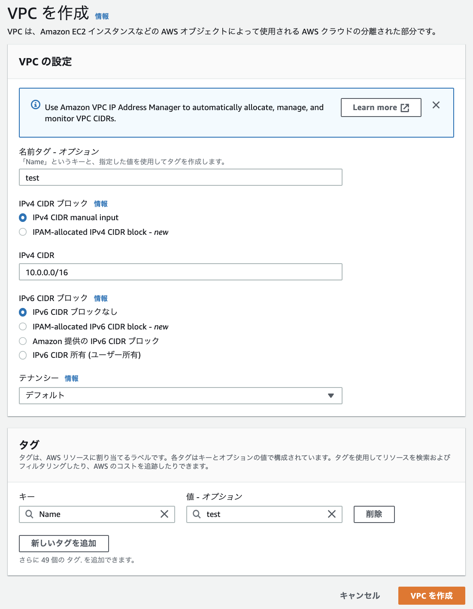
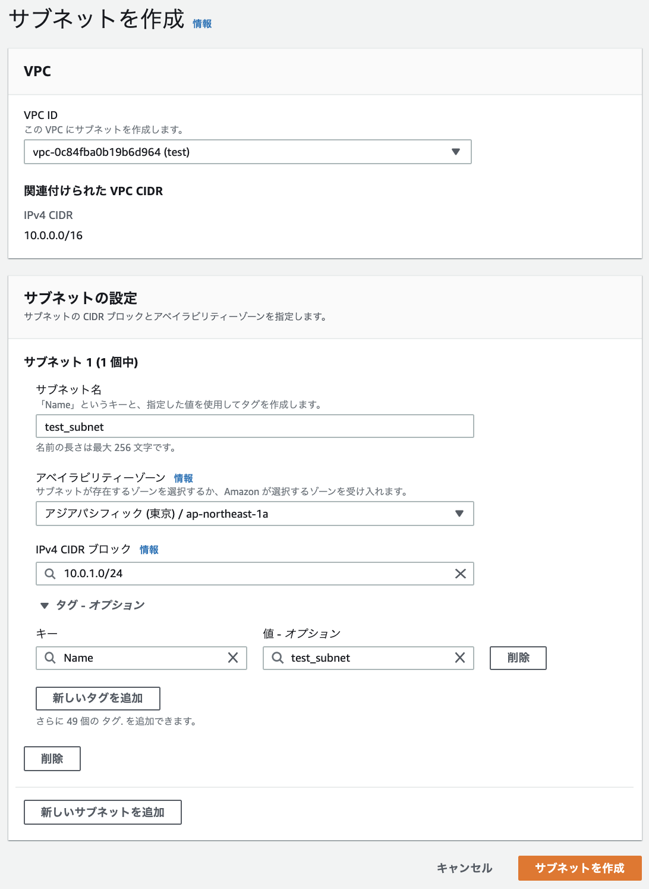
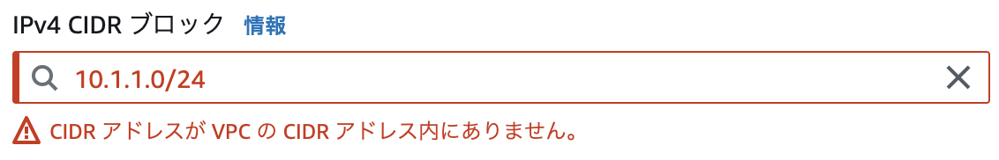
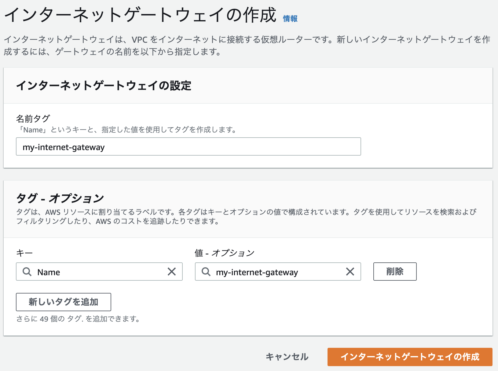
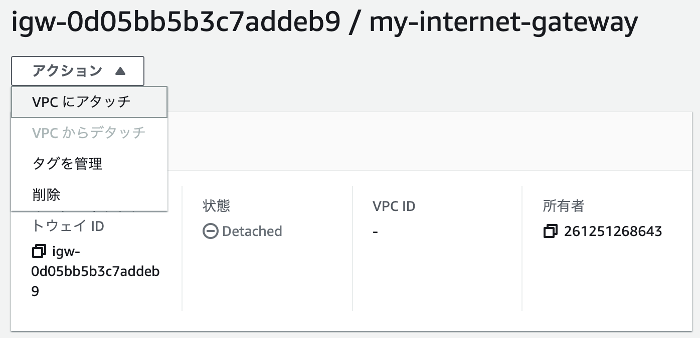
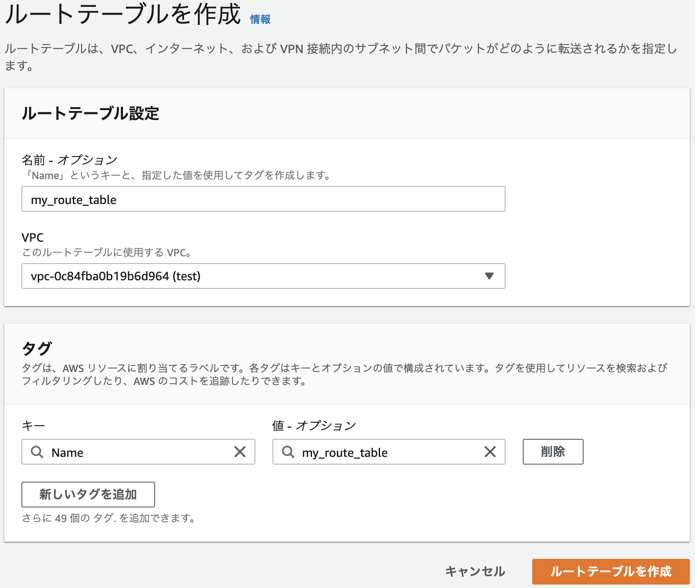
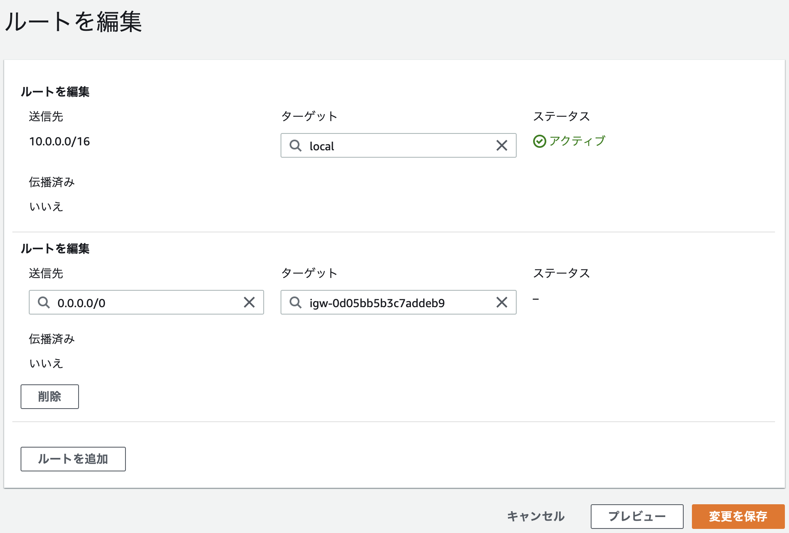
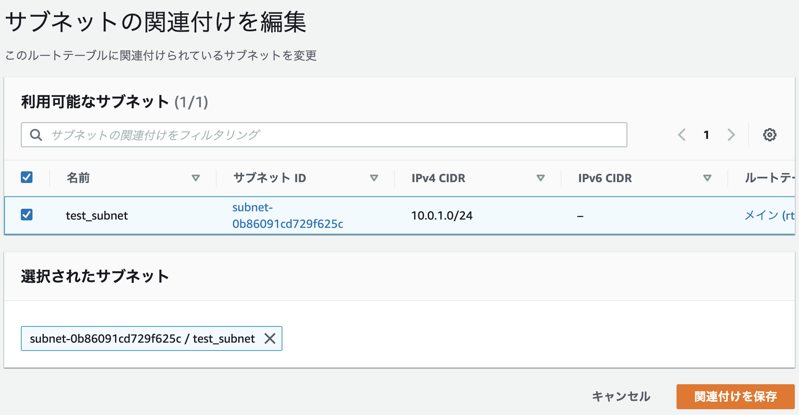

# scaffold_aws

RailsアプリをAWSにデプロイする練習

## scaffoldでアプリ作成
```
$ rails new scaffold_aws
$ cd scaffold_aws
$ rails g scaffold tweet title:string content:text
```

## VPCの作成
Virtual Private Cloud

ユーザー独自の空間、それぐらいの認識



名前タグは設定しておいた方が管理画面で分かりやすい

CIDRは前から何ビットまでがネットワーク部かを示すもの 例えば`10.0.0.0/16`だったら、`10.0`がネットワーク部、`0.0`がホスト部になる ホスト部に割り当てられたIPアドレスの数がネットワーク内で使用可能なIPアドレスの数になる

IPv4は32ビット、IPv6が128ビット

IPv6の例: `3002:0bd6:0000:0000:0000:ee00:0033:6778`

テナンシーは、VPCを作るときにハードウェアを占有するかの設定 共有テナンシーと占有テナンシーがあり、共有テナンシーは1台のホストを複数のAWSアカウントで共有する 占有テナンシーは1台のホストを1つのAWSアカウントで占有する 占有テナンシーの方がお金がかかるが、セキュリティ面を考慮して、他のアカウントと同居したくない時に使う デフォルトでは共有テナンシーが選択される

## サブネットの作成
VPCを細分化したもの この中にRDSやEC2を配置する



`10.0.0.0/16`のVPCで、`10.0.1`が先頭に来る256個のIPアドレスをグループ化したことになる

アベイラビリティゾーンは、AWSの各リージョン(東京やシドニー)に存在するデータセンターの場所 東京リージョンだとap-northeast-1aとap-northeast-1cとap-northeast-1dから選ぶことができる

`10.0.0.0/16`のVPCで、`10.1.1.0/24`のサブネットを作ろうとすると、VPCのホスト部にサブネットが入っていないので、エラーになる



## インターネットゲートウェイの作成
VPCが外部とやり取りするためのもの



作成しただけではVPCと紐づけられていない(Detached)



## ルートテーブルの作成
ルーティング(トラフィックの経路選択)のために必要、それぐらいの認識



この後にルートの編集を行う



`0.0.0.0/0`は全ての宛先を意味するもの([参考](https://www.wdic.org/w/WDIC/0.0.0.0))で、全ての宛先に対して、インターネットゲートウェイを通るようにする、という設定をしている

サブネットとも紐付ける必要がある


