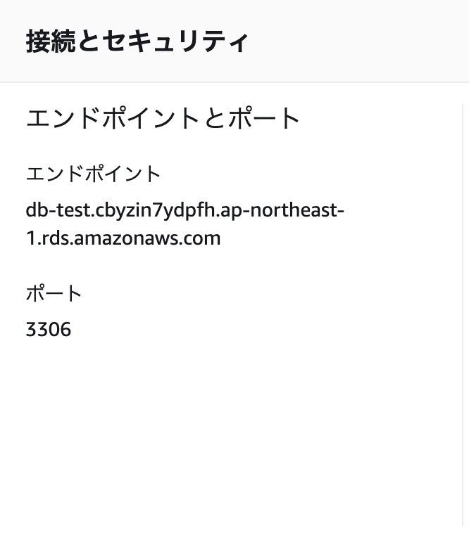

# scaffold_aws

RailsアプリをAWSにデプロイする練習

## scaffoldでアプリ作成
```
$ rails new scaffold_aws
$ cd scaffold_aws
$ rails g scaffold tweet title:string content:text
```

## VPCの作成
Virtual Private Cloud

ユーザー独自の空間、それぐらいの認識


名前タグは設定しておいた方が管理画面で分かりやすい

CIDRは前から何ビットまでがネットワーク部かを示すもの 例えば`10.0.0.0/16`だったら、`10.0`がネットワーク部、`0.0`がホスト部になる ホスト部に割り当てられたIPアドレスの数がネットワーク内で使用可能なIPアドレスの数になる

IPv4は32ビット、IPv6が128ビット

IPv6の例: `3002:0bd6:0000:0000:0000:ee00:0033:6778`

テナンシーは、VPCを作るときにハードウェアを占有するかの設定 共有テナンシーと占有テナンシーがあり、共有テナンシーは1台のホストを複数のAWSアカウントで共有する 占有テナンシーは1台のホストを1つのAWSアカウントで占有する 占有テナンシーの方がお金がかかるが、セキュリティ面を考慮して、他のアカウントと同居したくない時に使う デフォルトでは共有テナンシーが選択される

## サブネットの作成
VPCを細分化したもの この中にRDSやEC2を配置する


`10.0.0.0/16`のVPCで、`10.0.1`が先頭に来る256個のIPアドレスをグループ化したことになる

アベイラビリティゾーンは、AWSの各リージョン(東京やシドニー)に存在するデータセンターの場所 東京リージョンだとap-northeast-1aとap-northeast-1cとap-northeast-1dから選ぶことができる

`10.0.0.0/16`のVPCで、`10.1.1.0/24`のサブネットを作ろうとすると、VPCのホスト部にサブネットが入っていないので、エラーになる


## インターネットゲートウェイの作成
VPCが外部とやり取りするためのもの


作成しただけではVPCと紐づけられていない(Detached)


## ルートテーブルの作成
ルーティング(トラフィックの経路選択)のために必要、それぐらいの認識


この後にルートの編集を行う


`0.0.0.0/0`は全ての宛先を意味するもの([参考](https://www.wdic.org/w/WDIC/0.0.0.0))で、全ての宛先に対して、インターネットゲートウェイを通るようにする、という設定をしている

サブネットとも紐付ける必要がある


## セキュリティグループの作成
この通信は許可するとか、この通信は拒否するといった設定

インバウンドルールは、どんな通信が入ってくるのを許可するのか、アウトバウンドルールはどんな通信が出ていくのを許可するのか、の設定

タイプは、このタイプの通信が来たら受け入れるというもの(HTTPSとかSSHとか)

プロトコルとポート範囲はタイプを選択すると、大体自動的に設定される

ソースはどんなIPアドレスであれば通信を許可するかで、`0.0.0.0/0`を選択すると、リソースタイプはAnywhere-IPv4に自動的に設定される

アウトバウンドルールはデフォルトで、タイプはすべてのトラフィック、送信先は`0.0.0.0/0`に設定されている


説明は必須で、日本語は使えない

同様に、全ての送信元からのSSH接続を許可する`test_ssh`、全ての送信元からの全てのトラフィックを許可する`test_production`を作成する

`test_http`はサービスの利用者がEC2にアクセスするためのもので、`test_ssh`は開発者がEC2にアクセスするためのもので、`test_production`はEC2とRDSに設定して、この間の通信のみ許可するものらしい(ここ良く分からない)

## RDSの作成
Relational Database Service

エンジンのタイプはアプリケーションで使うのものを選択する


サブネットグループは、サブネットをまとめたものぐらいの認識

アベイラビリティゾーンが別のサブネットが2つないと、RDSを作成することができなかった


というわけで、ap-northeast-1cのサブネットを追加


これでRDSを作成できるようになった


マルチAZは、異なるアベイラビリティゾーンにRDSを配置し、問題が発生したときに、切り替えを行う仕組み 無料利用枠だと使用できない

## EC2の作成
Elastic Compute Cloud

この中にWebサーバーやアプリケーションサーバーを配置する

AMI(Amazon マシンイメージ)はAmazon Linux 2 AMIを選択する

インスタンスタイプ(CPUのスペックなどをプランにしたもの)は無料枠のt2.microを選択


色々あるが、ネットワーク、サブネット、自動割り当てパブリックIP以外はそのまま

自動割り当てパブリックIPは、パブリックIPを作成するインスタンスに自動で割り当てるかの設定で、これを有効にするとインスタンスを停止したタイミングでIPアドレスが変わったりするので、今回は無効に設定


そのまま


分かりやすいようにタグをつけておく


サービス利用者がアクセスするための`test_http`、開発者がSSH接続するための`test_ssh`、RDSと接続するための`test_production`を設定する


SSH接続する時に必要

## Elastic IPの作成
EC2の設定で、自動割り当てパブリックIPを無しに設定しているので、このままだとサービスにアクセスすることができない

デフォルトの設定で作成

その後、EC2と紐づける


(パブリックIPv4アドレスに注目)

## EC2へSSH接続
EC2を作成したときにダウンロードしたキーペアを.sshに移動する

```
$  mv ~/Downloads/test.pem ~/.ssh
```

作成したEC2からSSH接続の方法が見れる


.sshに移動し、書かれているコマンドを実行する

```
$ cd ~/.ssh
$ ssh -i "test.pem" ec2-user@13.113.171.196
```

初めての接続だけど大丈夫？と聞かれるのでyesで進む

すると、test.pemのパーミッションがオープンすぎるという警告が出て、接続できない

```
@@@@@@@@@@@@@@@@@@@@@@@@@@@@@@@@@@@@@@@@@@@@@@@@@@@@@@@@@@@
@         WARNING: UNPROTECTED PRIVATE KEY FILE!          @
@@@@@@@@@@@@@@@@@@@@@@@@@@@@@@@@@@@@@@@@@@@@@@@@@@@@@@@@@@@
Permissions 0644 for 'test.pem' are too open.
It is required that your private key files are NOT accessible by others.
This private key will be ignored.
Load key "test.pem": bad permissions
ec2-user@13.113.171.196: Permission denied (publickey,gssapi-keyex,gssapi-with-mic).
```

なので、以下のコマンドを実行して、自分だけ読み取り可能にする

```
$ chmod 400 test.pem
```

これで接続できるようになる

## ec2-userの削除
EC2にログインした時のユーザー、ec2-userはデフォルトで用意されているユーザーなので、攻撃を受けるリスクを減らすために、他のユーザーを作成し、ec2-userは削除する

ユーザーの作成とパスワードの設定

```
(EC2)
$ sudo adduser test
$ sudo passwd test
```

新しく作成したユーザーに管理者権限を与える

```
(EC2)
$ sudo visudo
```

エディタが開くので、`root ALL=(ALL) ALL`と書いてある部分を見つけ、以下のように編集する

```
## Allow root to run any commands anywhere
root    ALL=(ALL)       ALL
test    ALL=(ALL)       ALL
```

ユーザーをtestに切り替える

```
(EC2)
$ sudo su - test
```

testユーザーでEC2にログインできるように、設定を行う

ローカルで秘密鍵、公開鍵の作成
```
$ cd ~/.ssh
$ ssh-keygen -t rsa
```

リモートで公開鍵を登録

```
(EC2)
$ mkdir .ssh
$ cd .ssh
$ vi authorized_keys
```

ローカルで作成した公開鍵をauthorized_keysに書き込む

ローカルの~/.ssh/configを編集して、簡単に接続できるようにする

```
$ vi ~/.ssh/config
```

以下の内容を追加

```
Host test
  HostName 13.113.171.196
  Port 22
  User test
  IdentityFile ~/.ssh/id_rsa
```

これで`ssh test`でログインできるようになると思いたいが、.sshとauthorized_keysのパーミッションを変えないとできなかった

```
(EC2)
$ chmod 700 .ssh
$ chmod 600 .ssh/authorized_keys
```

最後にec2-userを削除する

```
(EC2)
$ sudo userdel -r ec2-user
```

## パッケージのインストール
まず、yum(パッケージ管理ツール)をアップデートする

```
(EC2)
$ sudo yum update
```

次に根幹となるパッケージをインストールする これは呪文

```
(EC2)
$ sudo yum install \
git make gcc-c++ patch \
openssl-devel \
zlib-devel readline-devel \
mysql mysql-devel \
eadline-devel \
epel-release
```

rbenv(Rubyのバージョン管理ツール)をインストールする
```
(EC2)
$ git clone https://github.com/sstephenson/rbenv.git ~/.rbenv
```

.bash_profileにrbenvのパスを通すコマンドを記述する

```
(EC2)
$ echo 'export PATH="$HOME/.rbenv/bin:$PATH"' >> ~/.bash_profile
$ echo 'eval "$(rbenv init -)"' >> ~/.bash_profile
$ source .bash_profile
```

`printenv PATH`でPATHに追加されたか確認できる

ruby-buildをインストールする rbenvとruby-buildで複数のバージョンのrubyが管理できるようになる

```
(EC2)
$ git clone https://github.com/sstephenson/ruby-build.git ~/.rbenv/plugins/ruby-build
$ rbenv rehash
```

rbenvを使って、使用するバージョンのRubyをインストールする

```
(EC2)
$ rbenv install -v 2.6.8
$ rbenv global 2.6.8
$ rbenv rehash
$ ruby -v
```

次にnode.jsをインストールする

```
(EC2)
$ curl -sL https://rpm.nodesource.com/setup_14.x | sudo bash -
```

↑これは呪文

```
(EC2)
$ sudo yum -y install nodejs
$ node -v
```

最後にyarnをインストール

```
(EC2)
$ curl -sL https://dl.yarnpkg.com/rpm/yarn.repo | sudo tee /etc/yum.repos.d/yarn.repo
$ sudo yum -y install yarn
$ yarn -v
```

## アプリケーションのセットアップ
/var/www/<アプリ名>にアプリを置くのが通例らしい

varの所有者と所有グループがrootになっているので、testに変更する

```
drwxr-xr-x  19 root root  269 12月 29 16:49 var
```

```
(EC2)
$ sudo chown test:test /var
```

```
drwxr-xr-x  19 test test  269 12月 29 16:49 var
```

var/にwwwを作成する

```
(EC2)
$ cd /var
$ mkdir www
```

GitHubにEC2からSSH接続できるようにする

まずはEC2で公開鍵と秘密鍵を作成する

```
(EC2)
$ cd ~/.ssh
$ ssh-keygen -t rsa
```

configに設定を記述する

```
(EC2)
$ vi config
```

以下を書く

```
Host github
  Hostname github.com
  User git
  IdentityFile ~/.ssh/id_rsa
```

id_rsa.pubをGitHubに登録する

configのパーミッションを変更して、GitHubにSSH接続する

```
(EC2)
$ chmod 700 config
$ ssh github
```

clone用のURLをコピーして、/var/wwwでcloneする


```
(EC2)
$ cd /var/www
$ git clone git@github.com:roaris/scaffold_aws.git
```

bundle installをするために、bundlerをインストールする bundlerのバージョンはGemfile.lockの一番下に書いてある

```
$ gem install bundler -v '2.2.27'
```

cloneしたディレクトリまで移動して`bundle`を実行

`An error occurred while installing sqlite3 (1.4.2), and Bundler cannot
continue.`とエラーが出た

`sudo yum install sqlite-devel`を実行することで解決する([参考](https://mebee.info/2021/01/14/post-27968/))

`yarn install`もする

## nginxのインストール
Webサーバーの役割

```
$ sudo amazon-linux-extras install nginx1
$ nginx -v
```

インストールが終わると、/etc/nginxが作成される 次に、nginxの設定を行う

```
$ sudo vi /etc/nginx/nginx.conf
```

デフォルトの内容を全て消して、以下に書き換える

```
user nginx;
worker_processes auto;
error_log /var/log/nginx/error.log;
pid /run/nginx.pid;

# Load dynamic modules. See /usr/share/doc/nginx/README.dynamic.
include /usr/share/nginx/modules/*.conf;

events {
    worker_connections 1024;
}

http {
    log_format  main  '$remote_addr - $remote_user [$time_local] "$request" '
                      '$status $body_bytes_sent "$http_referer" '
                      '"$http_user_agent" "$http_x_forwarded_for"';

    access_log  /var/log/nginx/access.log  main;

    sendfile            on;
    tcp_nopush          on;
    tcp_nodelay         on;
    keepalive_timeout   65;
    types_hash_max_size 4096;

    include             /etc/nginx/mime.types;
    default_type        application/octet-stream;

    # Load modular configuration files from the /etc/nginx/conf.d directory.
    # See http://nginx.org/en/docs/ngx_core_module.html#include
    # for more information.
    include /etc/nginx/conf.d/*.conf;

    gzip on;
    gzip_http_version 1.0;
    gzip_proxied any;
    gzip_min_length 500;
    gzip_disable "MSIE [1-6]\.";
    gzip_types text/plain text/xml text/css
               text/comma-separated-values
               text/javascript application/x-javascript
               application/atom+xml;
}
```

次にアプリケーション別のファイル作成をする

```
$ cd /etc/nginx/conf.d
$ sudo vi scaffold_aws.conf
```

以下の内容を書く

```
upstream puma {
  server unix:/var/www/scaffold_aws/tmp/sockets/puma.sock;
}

server {
  server_name  scaffold_aws.com;

  keepalive_timeout 0;

  access_log  /var/log/nginx/scaffold_aws.access.log  main;
  client_max_body_size 4G;

  root /var/www/test/public;
  location ~ .*\.(swf|SWF|ico|ICO|jar|txt|gz|js) {
    root /var/www/scaffold_aws/public;
    expires 15m;
    break;
  }
  location ~ ^\/fonts\/* {
    root /var/www/scaffold_aws/public;
    expires 15m;
    break;
  }
  location ~ ^\/assets\/* {
    root /var/www/scaffold_aws/public;
    break;
  }
  location ~ ^\/favicon\/* {
    root /var/www/scaffold_aws/public;
    break;
  }
  location = /manifest.json {
    root /var/www/scaffold_aws/public;
    break;
  }
  location / {
    proxy_set_header X-Forwarded-For $proxy_add_x_forwarded_for;
    proxy_set_header Host $http_host;
    proxy_redirect off;

    #auth_basic "Restricted";
    #auth_basic_user_file /etc/nginx/.htpasswd;
    #if ($http_x_forwarded_proto = "http") {
     #rewrite ^(.*) https://$server_name$1
      #break;
    #}
    proxy_pass http://puma;
  }
}
```

upstream pumaの部分はAPサーバーのソケット位置を記載していて、ここが間違っていると、WebサーバーとAPサーバーの連携が取れないので注意

`sudo nginx`で起動 設定を変更した場合は、`sudo nginx -s reload`

## pumaの起動
pumaはGemfileに書かれていて、`bundle install`でインストールされている

pumaの設定はconfig/puma.rbにあり、本番環境(EC2内)では、ソケットを作成する必要があるので、以下のように修正する

```
- port ENV.fetch("PORT") { 3000 }
+ if Rails.env == "production"
+   bind "unix:///var/www/scaffold_aws/tmp/sockets/puma.sock"
+ else
+  port ENV.fetch("PORT") { 3000 }
+ end
```

pumaを起動する

```
$ bundle exec pumactl start
```

これでうまくいかない `uninitialized constant #<Class:#<Puma::DSL:0x00000000014d3888>>::Rails`とエラーが出た puma.rbで使った`Rails`でエラーが出るらしい

結局EC2内で編集することにした

```
(EC2)
- port ENV.fetch("PORT") { 3000 }
+ bind "unix:///var/www/scaffold_aws/tmp/sockets/puma.sock"
```

`No such file or directory @ realpath_rec - /var/www/scaffold_aws/tmp/sockets`となったので、`mkdir tmp/sockets`した

これでpumaが起動するようになった

## RDSへの接続
RDSのエンドポイントをコピーしておく



```
$ EDITOR='vi' bin/rails credentials:edit
```

以下のように編集する

```
# aws:
#   access_key_id: 123
#   secret_access_key: 345

db:
  endpoint: db-test.cbyzin7ydpfh.ap-northeast-1.rds.amazonaws.com
  user_name: test
  password: パスワード
```

編集を終えると、config/credentials.yml.encが作成される これはRDSのエンドポイントやユーザー名、パスワードを暗号化したもので、config/master.keyを使うことで復元することができる

config/credentials.yml.encをpushした後、EC2でconfig/master.keyを作成し、ローカルのmaster.keyをコピーする

```
$ cd config
$ touch master.key
$ chmod 600 master.key
$ vi master.key
```

EC2でも`EDITOR='vi' bin/rails credentials:edit`を行い、正しく復元できるかを確認する

database.ymlで本番環境のDB設定を行う

```
production:
  database: scaffold_aws
  adapter: mysql2
  encoding: utf8mb4
  charset: utf8mb4
  collation: utf8mb4_general_ci
  username: <%= Rails.application.credentials.db[:user_name] %>
  password: <%= Rails.application.credentials.db[:password] %>
  host: <%= Rails.application.credentials.db[:endpoint] %>
  pool: 20
  timeout: 1000
```

データベースの作成とマイグレートをする

```
$ export RAILS_ENV=production
$ bin/rails db:create
Created database 'scaffold_aws'
$ bin/rails db:migrate
== 20211227125849 CreateTweets: migrating =====================================
-- create_table(:tweets)
   -> 0.0229s
== 20211227125849 CreateTweets: migrated (0.0231s) ============================
```

## ログを見る
以上の手順で大体おしまいだが、`http://13.113.171.196/tweets`を開いても上手くいかない


502 Bad Gateway の場合は、/etc/nginx/nginx.confで設定した、エラーログを出力するファイル(/var/log/nginx/error.log)を見てみよう

```
$ sudo less /var/log/nginx/error.log
```


We're sorry, but something went wrong. の場合は、アプリケーション側のエラーなので、log/producton.logを見てみよう

```
$ less log/production.log
```

今回の場合は、アプリケーション側のエラーで、`ActionView::Template::Error (The asset "application.css" is not present in the asset pipeline.`というエラー文がログに出ていた


